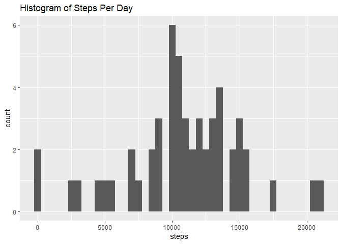
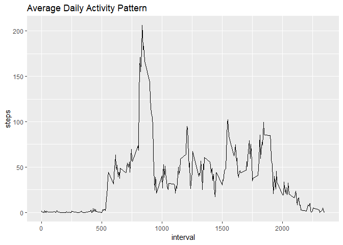
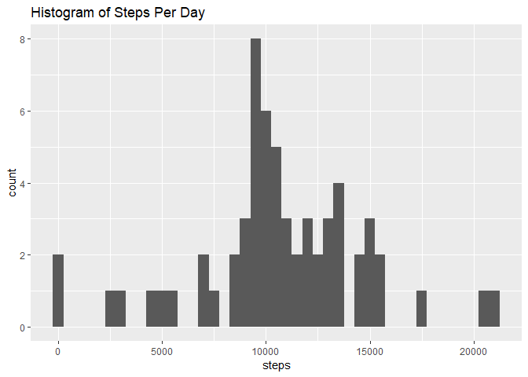
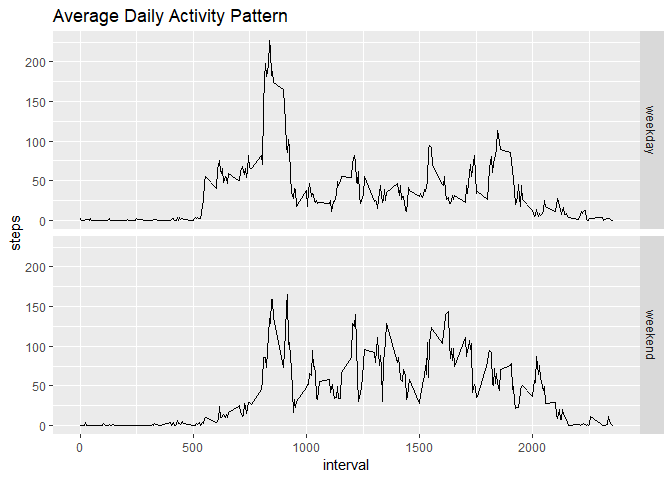

## Loading and preprocessing the data


```r
unzip("activity.zip")
df <- read.csv("activity.csv")
df$date <- as.Date(df$date)
# df2 has NA steps removed
df2 <- df[!is.na(df$steps),]
# df3 has NA steps replaced with 0
df3 <- df
zeroes <- vector(mode="numeric", length=nrow(df))
df3[is.na(df3$steps),"steps"] <- zeroes[is.na(df3$steps)]
summary(df)
```

```
##      steps             date               interval     
##  Min.   :  0.00   Min.   :2012-10-01   Min.   :   0.0  
##  1st Qu.:  0.00   1st Qu.:2012-10-16   1st Qu.: 588.8  
##  Median :  0.00   Median :2012-10-31   Median :1177.5  
##  Mean   : 37.38   Mean   :2012-10-31   Mean   :1177.5  
##  3rd Qu.: 12.00   3rd Qu.:2012-11-15   3rd Qu.:1766.2  
##  Max.   :806.00   Max.   :2012-11-30   Max.   :2355.0  
##  NA's   :2304
```


## What is mean total number of steps taken per day?


```r
perDay <- aggregate(df2$steps, list(df2$date), sum)
names(perDay) <- c("date", "steps")
perDay <- perDay[!is.na(perDay$steps),]
ggplot(perDay, aes(steps)) + geom_histogram(binwidth=500) + ggtitle("Histogram of Steps Per Day")
```

<!-- -->

Mean and median steps per day:

```r
cat("mean:", mean(perDay$steps), "median:", median(perDay$steps))
```

```
## mean: 10766.19 median: 10765
```


## What is the average daily activity pattern?


```r
perInterval <- aggregate(df2$steps, list(df2$interval), mean, na.action=na.exclude)
names(perInterval) <- c("interval", "steps")
ggplot(perInterval, aes(interval, steps)) + geom_line() + ggtitle("Average Daily Activity Pattern")
```

<!-- -->

Maximum average interval:

```r
maxRow <- perInterval[which.max(perInterval$steps),]
cat("interval #", maxRow$interval, " has the max with ", maxRow$steps, " average steps", sep="")
```

```
## interval #835 has the max with 206.1698 average steps
```


## Imputing missing values

Number of missing values:


```r
sum(is.na(df$steps))
```

```
## [1] 2304
```


```r
perInterval <- aggregate(df3$steps, list(df3$interval), mean)
names(perInterval) <- c("interval", "steps")

df4 <- df
for(i in 1:nrow(df4)) {
  if(is.na(df4$steps[i])) {
    df4$steps[i] <- perInterval[perInterval$interval == df4$interval[i], "steps"]
  }
}
perDay <- aggregate(df4$steps, list(df4$date), sum)
names(perDay) <- c("date", "steps")
perDay <- perDay[!is.na(perDay$steps),]
ggplot(perDay, aes(steps)) + geom_histogram(binwidth=500) + ggtitle("Histogram of Steps Per Day")
```

<!-- -->

Mean and median steps per day:

```r
cat("mean:", mean(perDay$steps), "median:", median(perDay$steps))
```

```
## mean: 10581.01 median: 10395
```

## Are there differences in activity patterns between weekdays and weekends?


```r
df4$dow <- weekdays(df4$date)
df4$weekday <- "weekday"
df4$weekday[(df4$dow == "Saturday" | df4$dow == "Sunday")] <- "weekend"
df4$weekday <- as.factor(df4$weekday)
perInterval <- aggregate(steps ~ interval + weekday, df4, mean)
ggplot(perInterval, aes(interval, steps)) + geom_line() + ggtitle("Average Daily Activity Pattern") + facet_grid(weekday ~ .)
```

<!-- -->
